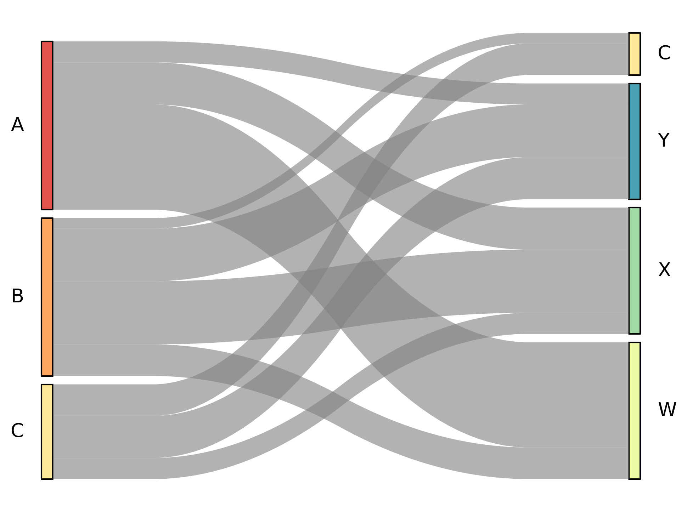

# matSankey


A lightweight Python package for creating [Sankey diagrams](https://en.wikipedia.org/wiki/Sankey_diagram) using matplotlib, flowing left to right.

matSankey is designed to integrate naturally into your existing matplotlib figures — just pass an `ax` argument and the diagram renders as a subplot alongside your other plots. Note that matSankey supports **one-level flows only** (A → B). Multi-level flows (A → B → C) are not yet supported.



## Installation

**From PyPI:**
```bash
pip install matSankey
```

**From source:**
```bash
git clone https://github.com/LissHall/matSankey.git
cd matSankey
pip install .
```

**Dependencies:**
```bash
pip install matplotlib seaborn numpy
```

## Quick Start

```python
import matplotlib.pyplot as plt
from matsankey.sankey import sankey

left   = ['A', 'A', 'B', 'B']
right  = ['X', 'Y', 'X', 'Y']
weight = [100,  50,  30, 120]

fig, ax = plt.subplots(figsize=(8, 5))
sankey(left=left, right=right, leftWeight=weight, ax=ax)
plt.savefig('sankey.png', bbox_inches='tight', dpi=150)
```

## Parameters

| Parameter        | Default  | Description                                        |
| ---------------- | -------- | -------------------------------------------------- |
| `left`           | required | Labels on the left side                            |
| `right`          | required | Labels on the right side                           |
| `leftWeight`     | `None`   | Weights for each flow (defaults to 1)              |
| `rightWeight`    | `None`   | Right-side weights (defaults to `leftWeight`)      |
| `colorDict`      | `None`   | Dict mapping labels to colors `{'label': 'color'}` |
| `leftLabels`     | `None`   | Custom order for left labels                       |
| `rightLabels`    | `None`   | Custom order for right labels                      |
| `aspect`         | `4`      | Vertical extent relative to horizontal             |
| `rightColor`     | `False`  | Color strips by right label instead of left        |
| `grayStrips`     | `False`  | Force all strips to grey                           |
| `stripAlpha`     | `0.65`   | Strip transparency                                 |
| `palette`        | `"hls"`  | Seaborn palette for auto-coloring                  |
| `title`          | `None`   | Diagram title                                      |
| `fontsize`       | `12`     | Label font size                                    |
| `leftLabelhide`  | `None`   | List of left labels to hide                        |
| `rightLabelhide` | `None`   | List of right labels to hide                       |
| `ax`             | `None`   | Matplotlib axis to plot on                         |
| `figureName`     | `None`   | Save figure to `figureName.png` (standalone only)  |
| `closePlot`      | `False`  | Close plot after saving (standalone only)          |

## License

GNU General Public License v3.0
